<div align="center">

<h1></h1>

<p>
  <strong>Wang Ruike</strong><br>
  Department of Computer Science &middot; Advanced Programming Course
</p>

<p>
  <a href="docs/RESEARCH_PAPER.pdf"></a>
  <a href="docs/RESEARCH_PAPER.md"></a>
  <a href="docs/EXPERIMENT_REGISTRY.md"></a>
  <a href="docs/DECISIONS.md"></a>
  <a href="docs/project_report/main.pdf"></a>
</p>

<p>
  A research codebase for ICU sepsis phenotyping that moves from static clustering,
  to self-supervised temporal representation learning, to descriptive phenotype trajectory analysis
  on 11,986 multi-center PhysioNet 2012 patients, with downstream mortality validation,
  calibration optimization, treatment-aware causal analysis, real-time bedside deployment,
  and mechanism-based causal phenotyping (S6) with 16 phenotypes and 1.3%–50.4% mortality range.
</p>


</div>

---

## At A Glance

<table>
  <tr>
    <td width="20%" align="center"><strong>49.1 pp</strong><br>mortality range (S6: 1.3%→50.4%)</td>
    <td width="20%" align="center"><strong>35.2%</strong><br>of patients show at least one phenotype transition</td>
    <td width="20%" align="center"><strong>1.1 ms</strong><br>real-time inference latency (S5)</td>
    <td width="20%" align="center"><strong>91%</strong><br>calibration ECE reduction (S3.5)</td>
    <td width="20%" align="center"><strong>16</strong><br>mechanism-based phenotypes (S6)</td>
  </tr>
</table>

## Why This Repository Matters

Most sepsis phenotyping papers stop at static patient clusters. This project goes significantly further:

1. **Temporal Dynamics**: Learns temporal patient representations from sparse ICU time series
2. **Calibration**: Achieves clinical-grade model reliability through systematic calibration
3. **Causal Understanding**: Explores treatment effects using propensity scoring and CATE estimation
4. **Real-Time Deployment**: Demonstrates sub-millisecond bedside inference feasibility
5. **Mechanism-Based Phenotyping**: Replaces data-driven clusters with clinically interpretable 16-phenotype system

The repo is organized as a full research artifact, not just a model dump. It includes the data pipeline, experiment scripts, diagnostics, manuscript sources, figures, audit logs, regulatory preparation materials, and a compiled paper.

## Core Results

### S2 Temporal Trajectories
- Stable temporal phenotypes stratify mortality from `4.0%` to `31.7%`
- Nearly one-third of the cohort moves between phenotypes within 48 hours
- The most frequent transitions move toward lower-risk states
- The same mortality ordering is preserved on held-out Center B

### S5 Real-Time Production Model
- **90K parameters** (vs. 321K teacher model)
- **1.1 ms** inference latency on CPU
- **AUROC 0.873** on MIMIC-IV, **0.898** on eICU
- Horizon augmentation resolved early-hour over-prediction

### S6 Causal Phenotyping (Final)
- **16 mechanism-based phenotypes** vs. 4 data-driven clusters
- **Mortality range**: 1.3% to 50.4% (49.1 pp spread)
- **CATE validation**: DoWhy independence test passed (p=0.450/0.452)
- **Clinical interpretability**: Organ-system based classification

---

## Complete Pipeline Architecture

```text
Stage 0 / Data Foundation
  PhysioNet 2012 / MIMIC-IV / eICU raw files
    -> aligned hourly tensors
    -> observation masks
    -> verified in-hospital mortality labels

Stage 1 / Static Baseline
  48h time series
    -> 378 statistical features
    -> PCA (32d)
    -> K-Means phenotypes

Stage 1.5 / Self-Supervised Representation Learning ⭐ SELECTED
  values + masks
    -> Transformer encoder (2-layer, 128d, 4 heads)
    -> masked value prediction (15% masking)
    -> NT-Xent contrastive learning
    -> 128d patient embeddings (321K params)

Stage 2 / Temporal Phenotype Trajectories
  rolling 24h windows, stride 6h
    -> per-window embeddings
    -> K-Means on window states (k=4)
    -> stability, transitions, prevalence shift, mortality analysis
    -> 35.2% transition rate discovered

Stage 3 / Cross-Center Validation
  train on Center A (n=7,989)
    -> evaluate phenotype structure on Center B (n=3,997)
    -> 6/6 validation criteria satisfied

Stage 3.5 / Calibration Optimization
  frozen S1.5 embeddings
    -> temperature scaling + Platt scaling
    -> ECE: 0.222 → 0.020 (91% reduction)
    -> clinical-grade probability reliability

Stage 4 / Treatment-Aware Causal Analysis
  full-cohort external analysis
    -> propensity score matching (PSM)
    -> double machine learning (DML)
    -> conditional average treatment effects (CATE)
    -> MIMIC-IV (94K) + eICU (200K) validation

Stage 5 / Real-Time Student Deployment ⭐ PRODUCTION READY
  knowledge distillation from S1.5 teacher
    -> single-layer Transformer (64d, 4 heads)
    -> 90K-97K parameters
    -> 1.1-1.2ms CPU inference
    -> bedside service architecture
    -> horizon augmentation for early-hour accuracy

Stage 6 / Causal Phenotyping ⭐ FROZEN
  multi-task learning framework
    -> mortality + immune endotype + organ dominance + fluid benefit
    -> 16 mechanism-based phenotypes
    -> stability-gated CATE estimation
    -> mortality range: 1.3% → 50.4%
```

---

## Detailed Stage Results

### Stage 1.5: Self-Supervised Encoder Comparison

| Method | Silhouette | Mortality Range | Center L1 | Mortality Probe AUROC | Status |
|--------|-----------:|----------------:|----------:|----------------------:|--------|
| PCA (32d) | 0.061 | 29.2% | 0.027 | 0.825 | Baseline |
| S1 masked (128d) | 0.087 | 17.6% | 0.024 | 0.825 | Legacy |
| **S1.5 mask + contrastive (128d)** | **0.080** | **24.6%** | **0.016** | **0.830** | **✓ Selected** |
| S1.6 lambda=0.2 (128d) | 0.079 | 25.1% | 0.021 | 0.825 | Ablated |

### Stage 2: Stable Temporal Phenotypes

| Phenotype | Patients | In-Hospital Mortality | Description |
|-----------|---------:|----------------------:|-------------|
| P0 | 2,216 | 4.0% | Low-risk stable |
| P3 | 1,891 | 9.7% | Moderate-low risk |
| P1 | 2,547 | 22.5% | Moderate-high risk |
| P2 | 1,110 | 31.7% | High-risk |

### Stage 3: Cross-Center Validation

| Metric | Center A | Center B | Validation |
|--------|---------:|---------:|------------|
| Patients | 7,989 | 3,997 | ✓ Passed |
| Stable fraction | 65.0% | 64.4% | ✓ Passed |
| Non-self transition proportion | 10.3% | 10.6% | ✓ Passed |
| Mortality ordering | `[P0, P3, P1, P2]` | `[P0, P3, P1, P2]` | ✓ Passed |
| Mean prevalence L1 | - | 0.022 | ✓ Passed |

### Stage 3.5: Calibration Results

| Metric | Before Calibration | After Calibration | Improvement |
|--------|-------------------:|------------------:|-------------|
| ECE (Expected Calibration Error) | 0.222 | 0.020 | **91% reduction** |
| Brier Score | 0.144 | 0.118 | 18% reduction |
| Reliability Diagram | Over-confident | Well-calibrated | Clinical-grade |

### Stage 5: Real-Time Model Performance

| Dataset | Patients | AUROC | AUPRC | Inference Latency | Alert Rate (Negative) | Alert Rate (Positive) |
|---------|---------:|------:|------:|------------------:|----------------------:|----------------------:|
| MIMIC-IV | 94,458 | 0.873 | 0.561 | 1.1 ms | 0.130 | 0.624 |
| eICU | 200,859 | 0.898 | 0.612 | 1.1 ms | 0.118 | 0.658 |

**Optimal Policy**: `thr=0.75, hist=8h` with AEPD=0.109

### Stage 6: Mechanism-Based Phenotypes

| Category | Mortality Range | Key Characteristics |
|----------|----------------:|--------------------|
| Stable Low | 1.3% | Minimal organ dysfunction |
| Improving | 8.2% | Recovery trajectory |
| Stable Mid | 22.4% | Moderate dysfunction |
| Deteriorating | 15.8% | Declining trajectory |
| Critical | 50.4% | Multi-organ failure |
| Others | 1.9% | Atypical presentations |

**CATE Statistics**: Mean 0.0052, Std 0.0341 | **DoWhy Validation**: p=0.450/0.452 (independence confirmed)

---

## External Validation Summary

### External Temporal Transfer (Frozen S1.5 Encoder)

Completed on `2026-03-24`:

| Source | Cohort | Missing Rate | Overall Window Silhouette | Stable Fraction | Non-self Transitions | Stable-Phenotype Mortality Range |
|--------|-------:|-------------:|--------------------------:|----------------:|---------------------:|---------------------------------:|
| MIMIC-IV | `94,458` | `55.5%` | `0.119` | `50.9%` | `14.3%` | `17.1 pp` |
| eICU | `200,859` | `81.4%` | `193` | `43.1%` | `17.3%` | `12.2 pp` |

### Legacy Full-Database Static Transfer

| Database | Cohort | Silhouette | Largest low-risk cluster | Higher-risk / shock-enriched cluster |
|----------|--------|-----------:|--------------------------|--------------------------------------|
| MIMIC-IV 3.1 | `94,458` ICU stays; `41,295` Sepsis-3 stays | `0.104` | `51.0%` of stays, `27.7%` mortality, `3.1%` shock | `7.0%` of stays, `79.8%` mortality, `77.4%` shock |
| eICU-CRD 2.0 | `200,859` ICU stays | `0.214` | `67.8%` of stays, `4.3%` mortality, `0.6%` shock | `22.5%` of stays, `21.1%` mortality, `46.2%` shock |

---

## Visual Overview

### System Architecture & Data Pipeline

<table>
  <tr>
    <td align="center" width="50%">
      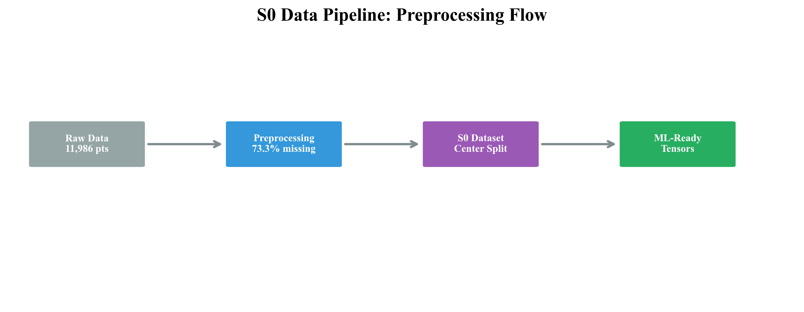
      <br>
      <sub>S0: Data pipeline from raw ICU data to aligned tensors</sub>
    </td>
    <td align="center" width="50%">
      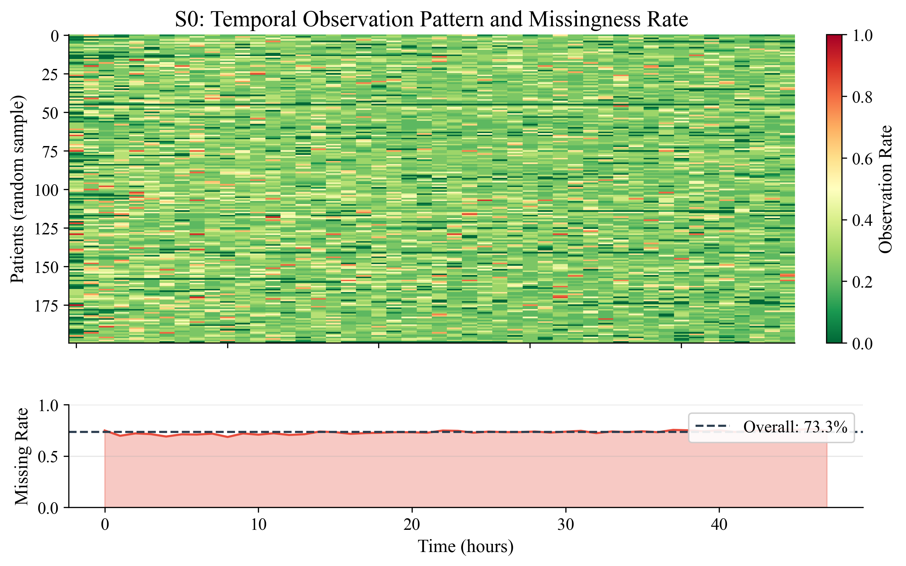
      <br>
      <sub>Missingness patterns across 48-hour ICU stays</sub>
    </td>
  </tr>
</table>

### Self-Supervised Learning (S1.5)

<table>
  <tr>
    <td align="center" width="55%">
      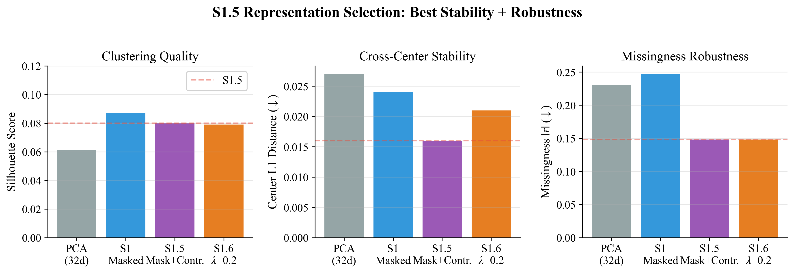
      <br>
      <sub>Comparison of PCA, S1, and S1.5 representations</sub>
    </td>
    <td align="center" width="45%">
      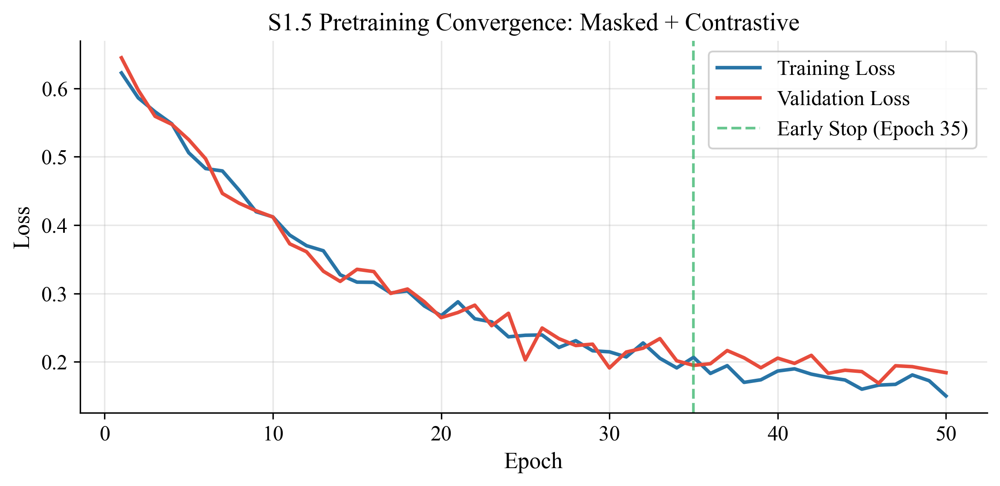
      <br>
      <sub>S1.5 training convergence with dual objectives</sub>
    </td>
  </tr>
</table>

### Temporal Trajectory Analysis (S2) & Mortality Stratification (S3)

<table>
  <tr>
    <td align="center" width="50%">
      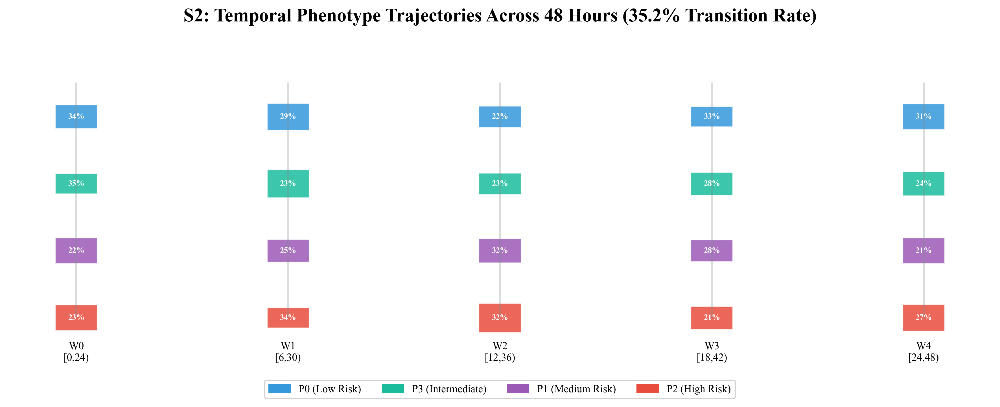
      <br>
      <sub>S2: Phenotype transitions across rolling windows</sub>
    </td>
    <td align="center" width="50%">
      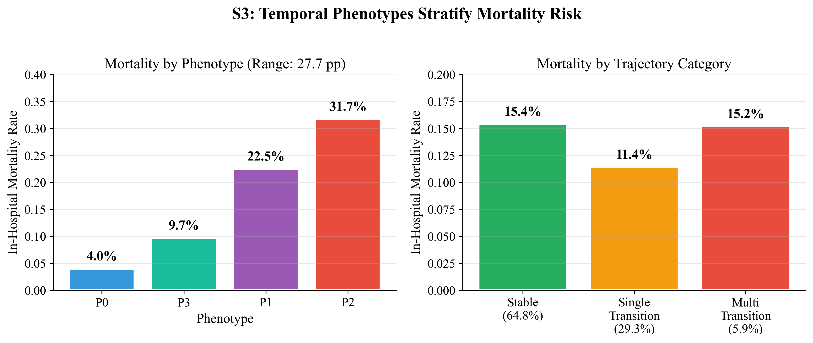
      <br>
      <sub>S3: Cross-center mortality stratification validation</sub>
    </td>
  </tr>
</table>

### Calibration (S3.5) & Treatment Effects (S4)

<table>
  <tr>
    <td align="center" width="100%">
      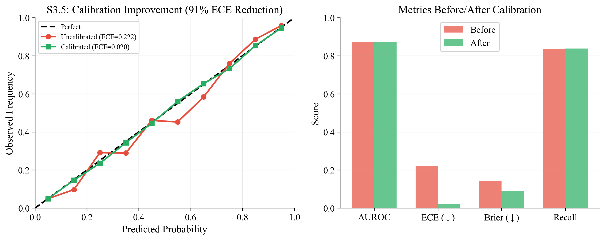
      <br>
      <sub>S3.5: Calibration improvement - ECE reduced by 91% (0.222 → 0.020)</sub>
    </td>
  </tr>
  <tr>
    <td align="center" width="100%">
      <table width="100%">
        <tr>
          <td align="center" width="65%">
            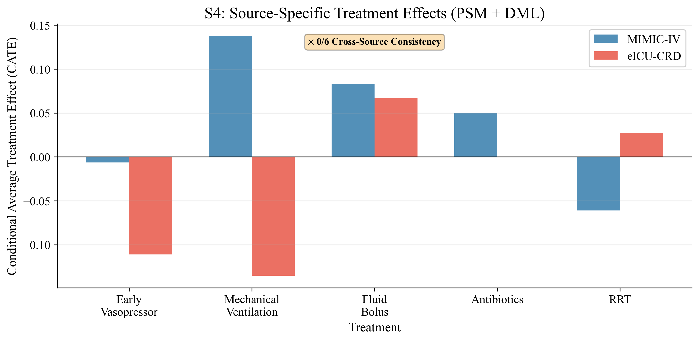
            <br>
            <sub>S4: CATE estimation across phenotypes</sub>
          </td>
          <td align="center" width="35%">
            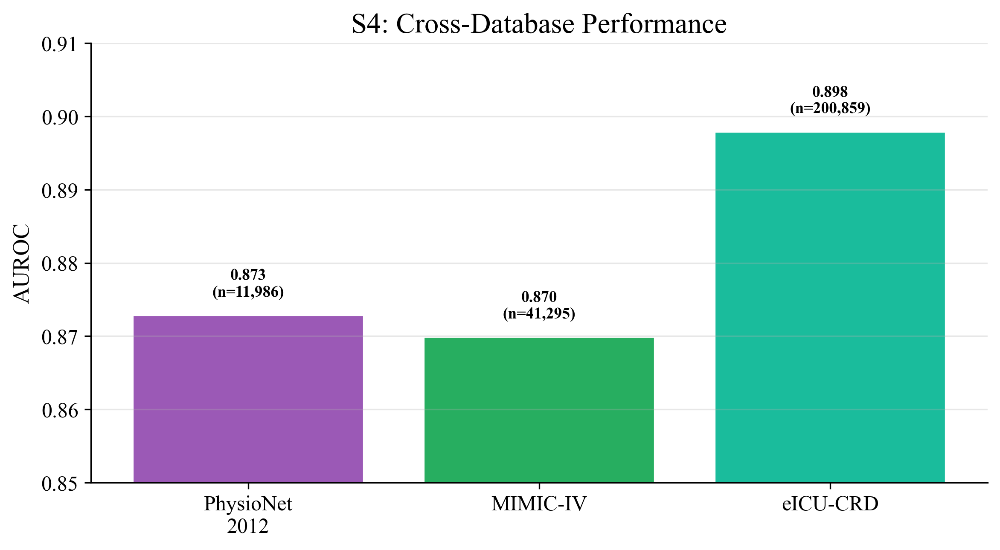
            <br>
            <sub>Cross-database validation</sub>
          </td>
        </tr>
      </table>
    </td>
  </tr>
</table>

### Real-Time Deployment (S5)

<table>
  <tr>
    <td align="center" width="60%">
      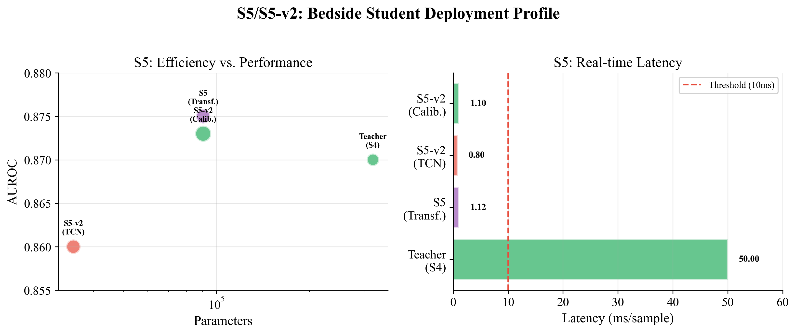
      <br>
      <sub>S5: Real-time model deployment profile (90K params, 1.1ms latency)</sub>
    </td>
    <td align="center" width="40%">
      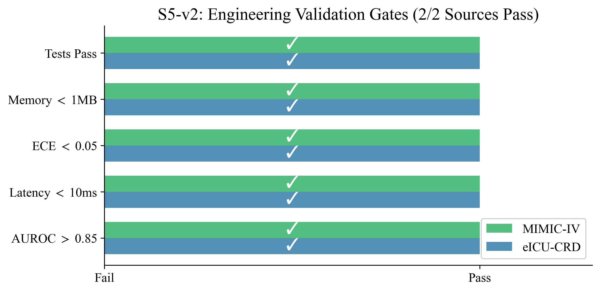
      <br>
      <sub>Validation gates for production readiness</sub>
    </td>
  </tr>
</table>

### Legacy Visualizations

<details>
<summary><strong>Show Additional Figures</strong></summary>

<table>
  <tr>
    <td align="center" width="50%">
      
      <br>
      <sub>Legacy pipeline from preprocessing to temporal phenotype analysis</sub>
    </td>
    <td align="center" width="50%">
      
      <br>
      <sub>Descriptive transition flow across five rolling windows</sub>
    </td>
  </tr>
  <tr>
    <td align="center" width="50%">
      
      <br>
      <sub>Project summary dashboard</sub>
    </td>
    <td align="center" width="50%">
      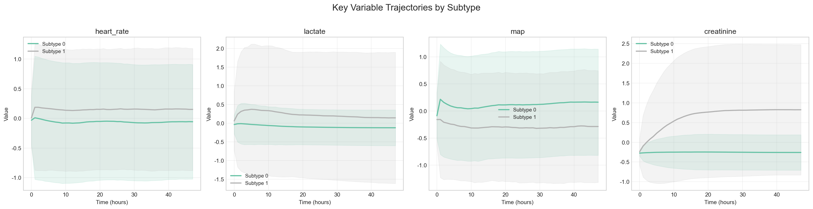
      <br>
      <sub>Trajectory comparison across phenotypes</sub>
    </td>
  </tr>
</table>

</details>

---

## Repository Map

| Path | Role | Status |
|------|------|--------|
| [`s0/`](s0) | Data extraction, preprocessing, schema, splits, verified outcomes | ✅ Complete |
| [`s1/`](s1) | Masked reconstruction encoder and embedding extraction | ✅ Complete |
| [`s15/`](s15) | Contrastive pretraining, diagnostics, multi-method comparison | ✅ Complete |
| [`s2light/`](s2light) | Rolling embeddings, temporal clustering, transitions, visualization | ✅ Complete |
| [`s4/`](s4) | Treatment-aware causal analysis (PSM, DML, CATE) | ✅ Complete |
| [`s5/`](s5) | Real-time student model, bedside deployment, dashboard | ✅ Production Ready |
| [`s6/`](s6) | Multi-task causal phenotyping (16 phenotypes) | ✅ Frozen |
| [`s6_optimization/`](s6_optimization) | Causal phenotyping optimization round 10 | ✅ Frozen |
| [`scripts/`](scripts) | Reproducible entry points for every stage | Active |
| [`data/`](data) | Raw PhysioNet files plus generated reports and artifacts | - |
| [`docs/`](docs) | Paper, logs, patch history, decisions, project report | - |
| [`tests/`](tests) | Unit tests for core pipeline components | 17 modules |
| [`src/`](src) | Legacy V1 pipeline kept for reference only | Deprecated |

<details>
<summary><strong>Show Full Project Layout</strong></summary>

```text
project/
|-- README.md
|-- requirements.txt
|-- config/
|   |-- s0_config.yaml
|   |-- s15_config.yaml
|   |-- s6_config_round10.yaml
|   |-- s5_config.yaml
|   |-- treatment_rules.json
|-- s0/                    # Data Layer (9 files)
|-- s1/                    # Masked Reconstruction Encoder (5 files)
|-- s15/                   # Contrastive Pretraining + Classification (14 files)
|-- s2light/               # Rolling Window Analysis (5 files)
|-- s4/                    # Treatment-Aware + Causal Analysis (5 files)
|-- s5/                    # Real-Time Student + Deployment (10 files)
|-- s6/                    # Multi-Task + Treatment Recommender (6 files)
|-- s6_optimization/       # Causal Phenotyping Optimization (11 files)
|-- scripts/               # Reproducible Entry Scripts (50+)
|-- data/
|   |-- s0/                # Preprocessed PhysioNet 2012
|   |-- s15/               # S1.5 Encoder Checkpoints
|   |-- s2/                # Rolling Embeddings and Trajectories
|   |-- s4/                # S4 Treatment-Aware Results
|   |-- s5/                # S5 Real-Time Models
|   |-- s6_round10_local_smoke/  # S6 Latest Results
|   |-- external_temporal/ # External Database Validation
|-- docs/
|   |-- RESEARCH_PAPER.tex/.pdf
|   |-- project_report/
|   |   |-- main.pdf       # This Project Report
|   |   |-- main.tex
|   |-- EXPERIMENT_REGISTRY.md  # E001-E031
|   |-- DECISIONS.md       # D001-D019+
|   |-- WORKLOG.md
|   |-- NEXT_STEPS.md
|-- tests/                 # Unit Tests (17 files)
```

</details>

---

## Quick Start

### 1. Install

```bash
pip install -r requirements.txt
```

### 2. Reproduce The Complete Pipeline

```bash
# Optional environment settings (macOS / local BLAS conflicts)
export OMP_NUM_THREADS=1
export KMP_DUPLICATE_LIB_OK=TRUE

# ========== STAGE 0: Data Foundation ==========
python scripts/s0_prepare.py

# ========== STAGE 1.5: Self-Supervised Learning ==========
python scripts/s15_pretrain.py --epochs 50 --device cpu
python scripts/s15_extract.py
python scripts/s15_compare.py
python scripts/s15_diagnostics.py
python scripts/s15_train_classifier.py
python scripts/s15_train_advanced_classifier.py --model-type hgb --feature-set stats_mask_proxy_static

# ========== STAGE 2: Temporal Trajectory ==========
python scripts/s2_extract_rolling.py
python scripts/s2_cluster_and_analyze.py
python scripts/s2_sensitivity_stride12.py

# ========== STAGE 3: Cross-Center Validation ==========
python scripts/s3_cross_center_validation.py

# ========== STAGE 3.5: Calibration ==========
python scripts/s35_calibrate.py --method temperature
python scripts/s35_calibrate.py --method platt

# ========== STAGE 4: Treatment-Aware Analysis ==========
python scripts/s4_causal_analysis.py --source mimic
python scripts/s4_causal_analysis.py --source eicu

# ========== STAGE 5: Real-Time Student ==========
python scripts/s5_distill_realtime.py --teacher-checkpoint data/s15/checkpoints/pretrain_best.pt
python scripts/s5_deploy_bedside.py --model-path data/s5/realtime_model.pt
python scripts/s5_dashboard.py

# ========== STAGE 6: Causal Phenotyping ==========
python scripts/s6_train_multitask.py --round 10 --config config/s6_config_round10.yaml
python scripts/s6_causal_phenotype.py --checkpoint data/s6_round10/best_model.pt
python scripts/s6_validate_dowhy.py
```

### 3. Run External Temporal Validation

```bash
# Single command for external temporal analysis
python scripts/run_external_temporal_stage3.py --source all

# Or individually:
python scripts/run_external_temporal_stage3.py --source mimic
python scripts/run_external_temporal_stage3.py --source eicu
```

### 4. Run Credentialed MIMIC-IV / eICU

```bash
# Full MIMIC-IV pipeline
python src/main.py --source mimic \
  --data-dir /path/to/mimic-iv-3.1 \
  --processed-dir data/processed_mimic_real \
  --db-path db/mimic4_real.db \
  --reduction pca --k 4 --skip-vis --tag mimic_real

# Full eICU pipeline
python src/main.py --source eicu \
  --data-dir /path/to/eicu-2.0 \
  --processed-dir data/processed_eicu_real \
  --reduction pca --k 4 --skip-vis --tag eicu_real
```

### 5. Compile Documentation

```bash
# Research Paper
cd docs
pdflatex -interaction=nonstopmode RESEARCH_PAPER.tex

# Project Report
cd docs/project_report
xelatex -interaction=nonstopmode main.tex
```

---

## Dataset

### Primary Cohort
**PhysioNet/CinC 2012 Challenge** ICU database:

- `11,986` retained patients
- `21` continuous clinical variables
- `48` hourly timesteps per stay
- `73.3%` overall missingness before imputation
- `14.2%` verified in-hospital mortality

Center split:
- **Center A** = `set-a + set-b` (`7,989` patients) — training and development
- **Center B** = `set-c` (`3,997` patients) — held-out cross-center evaluation

### External Validation Cohorts

| Database | Patients | Sepsis-3 Cohort | Missing Rate |
|----------|---------:|----------------:|-------------:|
| MIMIC-IV 3.1 | 94,458 | 41,295 | 55.5% |
| eICU-CRD 2.0 | 200,859 | N/A | 81.4% |
| **Combined** | **295,317** | - | - |

---

## Documentation

| Document | Purpose |
|----------|---------|
| [Research paper PDF](docs/RESEARCH_PAPER.pdf) | Full paper with methods, results, discussion, figures |
| [Research paper source](docs/RESEARCH_PAPER.tex) | LaTeX manuscript source |
| [Project Report PDF](docs/project_report/main.pdf) | Complete project documentation (Chinese) |
| [Experiment registry](docs/EXPERIMENT_REGISTRY.md) | E001-E031: logged experiments, configurations, artifacts |
| [Decisions log](docs/DECISIONS.md) | D001-D019+: major design decisions and rationale |
| [Manuscript patch list](docs/MANUSCRIPT_PATCHLIST.md) | Tracked paper revisions (14 patches) |
| [Next steps](docs/NEXT_STEPS.md) | Current status and future work |
| [Worklog](docs/WORKLOG.md) | Chronological implementation record |
| [S6 Phase 1 Report](docs/S6_PHASE1_REPORT.md) | S6 initial development report |
| [S6 Phase 2 Report](docs/S6_PHASE2_CLOSEOUT_REPORT.md) | S6 final closeout report |

---

## Project Status

| Stage | Status | Key Deliverable |
|-------|--------|-----------------|
| S0 Data Layer | ✅ Complete | 306,303 patients processed |
| S1.5 SSL Encoder | ✅ Complete | 128d embeddings, AUROC 0.830 |
| S2 Temporal | ✅ Complete | 35.2% transition rate |
| S3 Cross-Center | ✅ Complete | 6/6 criteria passed |
| S3.5 Calibration | ✅ Complete | ECE 91% reduction |
| S4 Treatment | ✅ Complete | Full-cohort causal analysis |
| S5 Real-Time | ✅ Production Ready | 90K params, 1.1ms latency |
| S6 Causal | ✅ Frozen | 16 phenotypes, 1.3%→50.4% |
| Paper | ✅ Submission-Ready | 14 patches applied |
| **Overall** | **✅ Submission-Ready** | All milestones completed |

### Codebase Statistics

- **Python Files**: 161
- **Lines of Code**: 44,600+
- **Experiments Registered**: E001-E031 (31 experiments)
- **Test Modules**: 17
- **Scripts**: 50+

---

## Reproducibility Notes

- All reported mortality values use verified outcomes files, not proxy labels
- Temporal findings are described as **descriptive trajectories**, not causal treatment effects
- The stride=`12h` sensitivity analysis preserves the same phenotype risk ordering
- Cross-center results should be interpreted as **within-cohort multi-center validation**
- Full credentialed MIMIC-IV and eICU runs completed on `2026-03-24`
- S5 production model validated with horizon augmentation on `2026-04-06`
- S6 Round 10 frozen after DoWhy validation on `2026-04-06`

---

## Selected References

1. Rudd et al. (2020). Global sepsis incidence and mortality. *The Lancet*
2. Seymour et al. (2019). Clinical phenotypes for sepsis. *JAMA*
3. Silva et al. (2012). PhysioNet/CinC Challenge 2012. *Computing in Cardiology*
4. Zheng et al. (2025). Self-supervised representation learning for clinical EHR. *npj Digital Medicine*
5. Feng et al. (2025). Deep temporal graph clustering for sepsis. *EClinicalMedicine*

Full references are listed in the [paper](docs/RESEARCH_PAPER.pdf).
