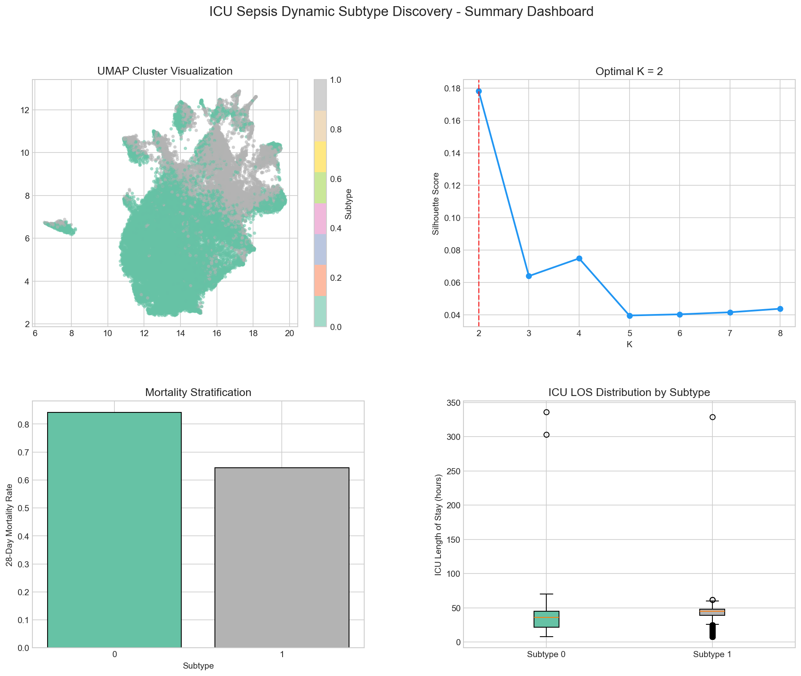
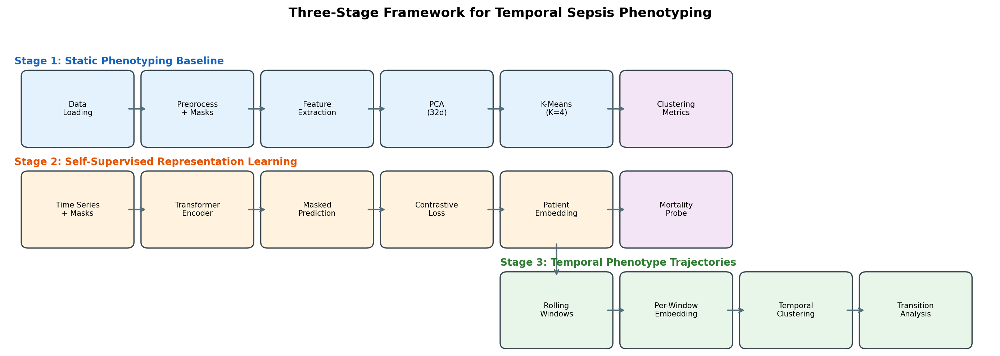
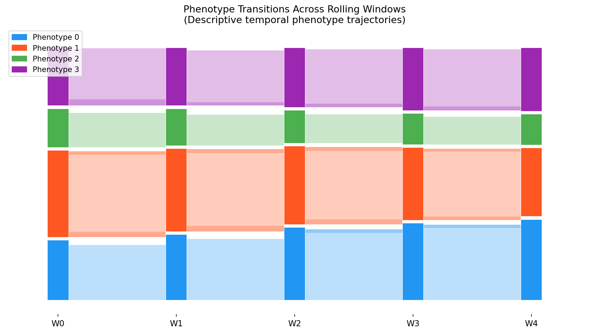

<div align="center">

<h1>Self-Supervised Temporal Phenotype Trajectory Analysis of ICU Sepsis Patients</h1>

<p>
  <strong>Wang Ruike</strong><br>
  Department of Computer Science &middot; Advanced Programming Course
</p>

<p>
  <a href="docs/RESEARCH_PAPER.pdf"></a>
  <a href="docs/RESEARCH_PAPER.md"></a>
  <a href="docs/EXPERIMENT_REGISTRY.md"></a>
  <a href="docs/DECISIONS.md"></a>
</p>

<p>
  A research codebase for ICU sepsis phenotyping that moves from static clustering,
  to self-supervised temporal representation learning, to descriptive phenotype trajectory analysis
  on 11,986 multi-center PhysioNet 2012 patients, with supplementary downstream mortality validation,
  Sepsis 2019 auxiliary data bridging, end-to-end supervised fine-tuning, leakage-aware OOF stacking,
  and systematic downstream hyperparameter search.
</p>



</div>

---

## At A Glance

<table>
  <tr>
    <td width="25%" align="center"><strong>27.7 pp</strong><br>mortality range across temporally stable phenotypes</td>
    <td width="25%" align="center"><strong>35.2%</strong><br>of patients show at least one phenotype transition</td>
    <td width="25%" align="center"><strong>6 / 6</strong><br>cross-center validation criteria satisfied</td>
    <td width="25%" align="center"><strong>14.2%</strong><br>verified in-hospital mortality from outcomes files</td>
  </tr>
</table>

## Why This Repository Matters

Most sepsis phenotyping papers stop at static patient clusters. This project goes one step further: it learns temporal patient representations from sparse ICU time series, then asks how phenotype membership evolves during the first 48 ICU hours.

The repo is organized as a full research artifact, not just a model dump. It includes the data pipeline, experiment scripts, diagnostics, manuscript sources, figures, audit logs, and a compiled paper.

## Core Result

The strongest result is not just that four phenotypes exist, but that their temporal trajectories are clinically structured:

- Stable temporal phenotypes stratify mortality from `4.0%` to `31.7%`.
- Nearly one-third of the cohort moves between phenotypes within 48 hours.
- The most frequent transitions move toward lower-risk states.
- The same mortality ordering is preserved on held-out Center B within the PhysioNet 2012 multi-center cohort.

> Caveat: this is cross-center validation within the same source dataset, not full external validation on an independently collected ICU database.

## Three-Stage Pipeline

```text
Stage 0 / Data Foundation
  PhysioNet 2012 raw files
    -> aligned hourly tensors
    -> observation masks
    -> verified in-hospital mortality labels

Stage 1 / Static Baseline
  48h time series
    -> 378 statistical features
    -> PCA (32d)
    -> K-Means phenotypes

Stage 1.5 / Self-Supervised Representation Learning
  values + masks
    -> Transformer encoder
    -> masked value prediction
    -> contrastive window objective
    -> 128d patient embeddings

Stage 2 / Temporal Phenotype Trajectories
  rolling 24h windows, stride 6h
    -> per-window embeddings
    -> K-Means on window states
    -> stability, transitions, prevalence shift, mortality analysis

Stage 3 / Cross-Center Validation
  train on Center A
    -> evaluate phenotype structure on Center B
```

## Supplementary Downstream Validation

```text
Frozen S1.5 embeddings
  -> logistic regression mortality classifier
  -> threshold tuning on Center A validation split
  -> held-out Center B accuracy / balanced accuracy / recall / AUROC

Bridged PhysioNet 2019 sepsis cohort (40,331 stays, 18/21 shared channels)
  -> auxiliary supervised transfer
  -> end-to-end attention-pooled mortality fine-tuning

Systematic downstream model search
  -> HGB / ensemble / logistic variants on fused multi-view features
  -> explicit accuracy vs recall trade-off under 14.6% mortality prevalence

OOF stacking committee + validation
  -> 5-fold leakage-aware dev-set stacking over HGB and logistic branches
  -> bootstrap CI, calibration audit, and meta-feature importance
```

## Visual Overview

<table>
  <tr>
    <td align="center" width="50%">
      
      <br>
      <sub>Pipeline from preprocessing to temporal phenotype analysis</sub>
    </td>
    <td align="center" width="50%">
      
      <br>
      <sub>Descriptive transition flow across five rolling windows</sub>
    </td>
  </tr>
</table>

## Methods Snapshot

### Stage 1: Static Baseline

- Uses 48-hour summary features as a conventional reference point.
- Establishes that the cohort contains clinically meaningful heterogeneity before deep learning.
- Baseline `K=4` result: silhouette `0.061`, mortality range `29.2 pp`.

### Stage 1.5: Mask-Aware Self-Supervised Encoder

- Input is `concat([values, masks])`, so missingness is treated as signal, not discarded.
- Pretraining combines:
  - masked value prediction on observed entries
  - temporal contrastive learning on stochastic 30-hour overlapping windows
- Best representation: `S1.5`, selected for center stability, missingness robustness, and rolling-window suitability.

### Stage 2: Temporal Phenotype Trajectories

- Extracts `5` rolling windows per patient: `[0,24)`, `[6,30)`, `[12,36)`, `[18,42)`, `[24,48)`.
- Clusters each window embedding into one of four phenotype states.
- Classifies patients as `stable`, `single-transition`, or `multi-transition`.

## Main Quantitative Results

### Representation Comparison

| Method | Silhouette | Mortality Range | Center L1 | Mortality Probe AUROC | Density \|r\| |
|--------|-----------:|----------------:|----------:|----------------------:|--------------:|
| PCA (32d) | 0.061 | 29.2% | 0.027 | 0.825 | 0.231 |
| S1 masked (128d) | 0.087 | 17.6% | 0.024 | 0.825 | 0.247 |
| **S1.5 mask + contrastive (128d)** | **0.080** | **24.6%** | **0.016** | **0.830** | **0.148** |
| S1.6 lambda=0.2 (128d) | 0.079 | 25.1% | 0.021 | 0.825 | 0.148 |

### Stable Temporal Phenotypes

| Phenotype | Patients | In-Hospital Mortality |
|-----------|---------:|----------------------:|
| P0 | 2,216 | 4.0% |
| P3 | 1,891 | 9.7% |
| P1 | 2,547 | 22.5% |
| P2 | 1,110 | 31.7% |

### Cross-Center Validation

| Metric | Center A | Center B |
|--------|---------:|---------:|
| Patients | 7,989 | 3,997 |
| Stable fraction | 65.0% | 64.4% |
| Non-self transition proportion | 10.3% | 10.6% |
| Mortality ordering | `[P0, P3, P1, P2]` | `[P0, P3, P1, P2]` |
| Highest-risk phenotype | `P2 (32.6%)` | `P2 (30.0%)` |
| Mean prevalence L1 | - | 0.022 |

### Supplementary Downstream Mortality Validation

| Model / Operating Point | Test Accuracy | Test Balanced Accuracy | Test Recall | Test AUROC |
|------------------------|--------------:|-----------------------:|------------:|-----------:|
| Frozen S1.5 probe, balanced threshold (`thr=0.55`) | 0.784 | 0.745 | 0.691 | 0.829 |
| Frozen S1.5 probe, accuracy threshold (`thr=0.85`) | 0.865 | 0.623 | 0.280 | 0.829 |
| End-to-end fine-tune + Sepsis2019 auxiliary supervision | 0.795 | 0.753 | 0.692 | 0.842 |
| Accuracy-search ensemble leader (`val acc` winner) | 0.871 | 0.660 | 0.361 | 0.863 |
| OOF stacking committee, balanced threshold | 0.803 | 0.792 | 0.776 | 0.873 |
| **OOF stacking committee, accuracy threshold** | **0.880** | 0.653 | 0.333 | **0.873** |
| Majority-class baseline | 0.854 | 0.500 | 0.000 | - |

Because held-out mortality prevalence is only `14.6%`, plain accuracy is misleading on its own. The new end-to-end fine-tuning path improves both the frozen-probe accuracy and AUROC without collapsing recall, while the accuracy-oriented searched ensemble pushes headline accuracy much higher by operating at a much lower positive rate.

### Improved Downstream Models

Using more of the already-available cohort information than the embedding-only linear probe:

- `End-to-end attention fine-tune + Sepsis2019 auxiliary supervision` reaches `test accuracy=0.795`, `balanced accuracy=0.753`, `recall=0.692`, `AUROC=0.842`
- `HGB + statistics + masks + proxy + static` reaches `test accuracy=0.791`, `balanced accuracy=0.780`, `AUROC=0.862`
- `HGB ensemble (fused + stats views)` reaches `balanced accuracy=0.785`, `recall=0.812`, `AUROC=0.865`
- `35-run accuracy-oriented search` selects an ensemble with `test accuracy=0.871`, `precision=0.601`, `recall=0.361`, `AUROC=0.863`
- The highest-AUROC searched configuration reaches `test accuracy=0.874`, `balanced accuracy=0.685`, `recall=0.417`, `AUROC=0.867`
- `5-fold OOF stacking committee` reaches `test accuracy=0.880`, `precision=0.682`, `recall=0.333`, `AUROC=0.873`
- The same stacking probabilities support a balance-oriented threshold with `test accuracy=0.803`, `balanced accuracy=0.792`, `recall=0.776`, `F1=0.536`
- Bootstrap validation shows `test AUROC 95% CI = [0.858, 0.888]`; calibration is weaker (`Brier=0.144`, `ECE=0.222`), so the best-ranking model is not the best-calibrated one

These models learn from more data modalities already present in the repository: 48h summary statistics, missingness patterns, proxy indicators, demographics, and optionally S1.5 embeddings.

## OpenClaw-Inspired Extensions

- `exploratory-data-analysis` informed the new demo-readiness reports emitted by [`scripts/prepare_mimic_demo.py`](scripts/prepare_mimic_demo.py) and [`scripts/prepare_eicu_demo.py`](scripts/prepare_eicu_demo.py).
- `bio-machine-learning-model-validation` motivated the new leakage-aware `train+val` OOF stacking workflow and the explicit bootstrap confidence intervals added under [`data/s15_trainval/stacking_accuracy/`](data/s15_trainval/stacking_accuracy/).
- `bio-machine-learning-prediction-explanation` motivated the new meta-feature importance and coefficient audit for the stacking model, saved in [`data/s15_trainval/stacking_accuracy/stacking_validation_report.json`](data/s15_trainval/stacking_accuracy/stacking_validation_report.json).
- The database-access skill family informed a reproducible DuckDB readiness/profile report for the local MIMIC pipeline, saved under [`data/mimic_db_profile/`](data/mimic_db_profile/).
- `scientific-manuscript` informed the manuscript and documentation updates that now distinguish clearly between demo-ready integration code and real external-validation results.

### Additional Data Integration

- `scripts/s19_prepare.py` bridges the local PhysioNet/CinC 2019 sepsis stubs into the same `continuous / masks / static / splits` layout used by `data/s0`
- The bridge covers `40,331` ICU stays with `18 / 21` shared continuous channels; the missing overlap channels are `gcs`, `sodium`, and `pao2`
- Preprocessing reuses the PhysioNet 2012 normalization statistics so the auxiliary source is numerically compatible with the pretrained S1.5 encoder
- `scripts/prepare_mimic_demo.py` now provides a formal `raw CSV -> DuckDB -> concepts -> patient_static/patient_timeseries` entry point for local MIMIC-IV demo files
- `scripts/prepare_eicu_demo.py` plus [`src/eicu_loader.py`](src/eicu_loader.py) now provide a formal `raw CSV -> 3D tensor + patient_info cache` entry point for local eICU demo files
- As of `2026-03-24`, the official PhysioNet demo pages for MIMIC-IV-demo and eICU-CRD-demo returned region-restricted `Data Not Available` responses from this environment, so the repository ships the integration code and smoke tests but not real demo-derived metrics

## Repository Map

| Path | Role |
|------|------|
| [`s0/`](s0) | Data extraction, preprocessing, schema, splits, and verified outcomes |
| [`s1/`](s1) | Masked reconstruction encoder and embedding extraction |
| [`s15/`](s15) | Contrastive pretraining, diagnostics, and multi-method comparison |
| [`s2light/`](s2light) | Rolling embeddings, temporal clustering, transitions, visualization |
| [`scripts/`](scripts) | Reproducible entry points for every stage |
| [`data/`](data) | Raw PhysioNet files plus generated reports and artifacts |
| [`docs/`](docs) | Paper, logs, patch history, decisions, and supporting docs |
| [`tests/`](tests) | Unit tests for core pipeline components |
| [`src/`](src) | Legacy V1 pipeline kept for reference only |

<details>
<summary><strong>Show Full Project Layout</strong></summary>

```text
project/
|-- README.md
|-- requirements.txt
|-- config/
|-- s0/
|-- s1/
|-- s15/
|-- s2light/
|-- scripts/
|-- data/
|-- docs/
|-- tests/
`-- src/
```

</details>

## Quick Start

### 1. Install

```bash
pip install -r requirements.txt
```

### 2. Reproduce The Main Pipeline

```bash
# Optional environment settings (macOS / local BLAS conflicts)
export OMP_NUM_THREADS=1
export KMP_DUPLICATE_LIB_OK=TRUE

# Stage 0: prepare aligned and processed PhysioNet 2012 tensors
python scripts/s0_prepare.py

# Stage 1.5: train and evaluate the selected self-supervised encoder
python scripts/s15_pretrain.py --epochs 50 --device cpu
python scripts/s15_extract.py
python scripts/s15_compare.py
python scripts/s15_diagnostics.py
python scripts/s15_train_classifier.py
python scripts/s15_train_advanced_classifier.py --model-type hgb --feature-set stats_mask_proxy_static
python scripts/s19_prepare.py
python scripts/s15_finetune_supervised.py
python scripts/s15_hparam_search.py --mode advanced --threshold-metric accuracy

# Stage 2: temporal phenotype trajectory analysis
python scripts/s2_extract_rolling.py
python scripts/s2_cluster_and_analyze.py

# Sensitivity analysis
python scripts/s2_sensitivity_stride12.py

# Stage 3: cross-center validation
python scripts/s3_cross_center_validation.py

# Optional: retrain a fresh S1.5 model in an isolated output directory
python scripts/s15_pretrain.py --config config/s15_trainval_config.yaml --device cpu
python scripts/s15_extract.py --config config/s15_trainval_config.yaml --device cpu
python scripts/s15_train_classifier.py --config config/s15_trainval_config.yaml
python scripts/s15_train_advanced_classifier.py --config config/s15_trainval_config.yaml --model-type hgb --feature-set stats_mask_proxy_static
python scripts/s15_train_advanced_classifier.py --config config/s15_trainval_config.yaml --model-type hgb_ensemble
```

### 2.5 Prepare Demo-Ready MIMIC / eICU Inputs

```bash
# MIMIC-IV demo/raw path: produces patient_static + patient_timeseries
python scripts/prepare_mimic_demo.py --data-dir data/external/mimic_iv_demo --output-dir data/processed_mimic_demo --db-path db/mimic4_demo.db

# Local mock smoke test for the same path
python scripts/prepare_mimic_demo.py --data-dir archive/mimic-iv-mock --output-dir /tmp/mimic_demo_out --db-path /tmp/mimic4_demo.db --format csv --overwrite-db

# eICU demo/raw path: produces cached tensor + patient_info + readiness report
python scripts/prepare_eicu_demo.py --data-dir data/external/eicu_demo --output-dir data/processed_eicu_demo
```

### 3. Compile The Paper

```bash
cd docs
pdflatex -interaction=nonstopmode RESEARCH_PAPER.tex
pdflatex -interaction=nonstopmode RESEARCH_PAPER.tex
```

## Dataset

The project is built around the **PhysioNet/CinC 2012 Challenge** ICU database:

- `11,986` retained patients
- `21` continuous clinical variables
- `48` hourly timesteps per stay
- `73.3%` overall missingness before imputation
- `14.2%` verified in-hospital mortality from outcomes files

Center split used in the project:

- **Center A** = `set-a + set-b` (`7,989` patients), used for training and development
- **Center B** = `set-c` (`3,997` patients), used for held-out cross-center evaluation

Raw challenge files are stored under [`data/external/`](data/external). Large derived arrays such as `.npy` tensors are excluded from version control where appropriate.

## Documentation

| Document | Purpose |
|----------|---------|
| [Research paper PDF](docs/RESEARCH_PAPER.pdf) | Full paper with methods, results, discussion, and figures |
| [Research paper source](docs/RESEARCH_PAPER.tex) | LaTeX manuscript source |
| [Experiment registry](docs/EXPERIMENT_REGISTRY.md) | Logged experiments, configurations, and artifact paths |
| [Decisions log](docs/DECISIONS.md) | Major design decisions and rationale |
| [Manuscript patch list](docs/MANUSCRIPT_PATCHLIST.md) | Tracked paper revisions |
| [Next steps](docs/NEXT_STEPS.md) | Current status and future work |
| [Worklog](docs/WORKLOG.md) | Chronological implementation record |

## Manuscript Status

The manuscript is currently **submission-ready**.

- Compiled PDF: [`docs/RESEARCH_PAPER.pdf`](docs/RESEARCH_PAPER.pdf)
- Current size: `17` pages
- Main content: `6` tables, `4` main figures, `5` supplementary figures
- Claims are tied back to logged experiments in [`docs/EXPERIMENT_REGISTRY.md`](docs/EXPERIMENT_REGISTRY.md)

## Reproducibility Notes

- All reported mortality values use verified outcomes files, not proxy labels.
- Temporal findings are described as **descriptive trajectories**, not causal treatment effects.
- The stride=`12h` sensitivity analysis preserves the same phenotype risk ordering.
- Cross-center results should be interpreted as **within-cohort multi-center validation**, not external database validation.
- The MIMIC/eICU integration paths are now demo-ready, but the official demo files were not downloadable from this environment on `2026-03-24`; place local credentialed copies under `data/external/` before running the prep scripts.

## Selected References

1. Rudd et al. (2020). Global sepsis incidence and mortality. *The Lancet*
2. Seymour et al. (2019). Clinical phenotypes for sepsis. *JAMA*
3. Silva et al. (2012). PhysioNet/CinC Challenge 2012. *Computing in Cardiology*
4. Zheng et al. (2025). Self-supervised representation learning for clinical EHR. *npj Digital Medicine*
5. Feng et al. (2025). Deep temporal graph clustering for sepsis. *EClinicalMedicine*

Full references are listed in the [paper](docs/RESEARCH_PAPER.pdf).
